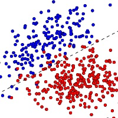

# Text classifier

*Tools for classifying topic and sentiment in text*

# Build

- Install [tensorflow](https://www.tensorflow.org/install/)
- `git checkout` with `--recursive`

# Sentiment

To classify sentiment, run:

    ./classify --config config.json

Where `config.json` is a configuration file listing documents. The format is:

    {
        "docs": [
            {
                "id": "<unique-id-used-for-annotation>",
                "title": "..",
                "text": "<path-to-plain-text-file>",
            },
            ..
        ],
        "version": ".."
    }

Running `./classify` will annotate the config with a `sentiment` key for every document:

    "sentiment": {
        "annotated": "<path-to-annotated-text-file>",
        "summary": "mean:<logistic>/<single> weighted:<logistic>/<single>",
        "mean": {
            "logistic": ..,
            "single": ..
        },
        "weighted": {
            "logistic": ..,
            "single": ..
        },
        "md5": ".."
    }

These values indicate:

- `mean`: the average sentiment score over all paragraphs in one document
- `weighted`: the weighted average sentiment score with paragraph length weights
- `logistic`: pre-trained logistic regression over all neurons in the sentiment LSTM
- `single`: the normalized value of the sentiment neuron (nr 2388)

This results in four different metrics for sentiment: `mean_logistic`, `weighted_single`, `weighted_logistic` and `weighted_single`. The accuracy of these values depends on aspects like writing style, paragraph length, vocabulary.
